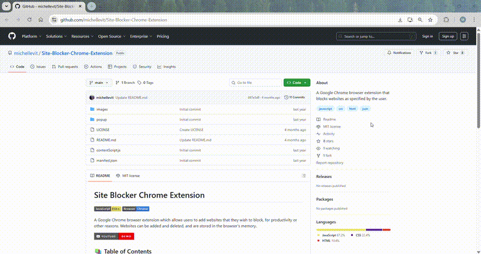

# Site Blocker Chrome Extension

A Google Chrome browser extension which allows users to add websites that they wish to block, for productivity or other reasons. Websites can be added and deleted, and are stored in the browser's memory.

## 📚 Table of Contents

- 📥 [How To Add the Extension to the Chrome Browser](#how-to-add)
- 🖥️ [How To Use the Extension](#how-to-use)
- 🛠️ [To Do](#to-do)
- ❤️ [Credits](#credits)

## 📥 How To Add the Extension to the Chrome Browser

- Open the repository on GitHub and click the green 'Code' button dropdown
- In the 'Local' tab, select the option to 'Download ZIP' and download it to a temporary location on your computer
- Unzip the folder
- In the Google Chrome browser, select the 'Extensions' option (puzzle icon beside URL bar), then click 'Manage Extensions'
- Toggle the 'Developer mode' option (in the upper right corner) to on
- Select 'Load unpacked'
- Find the folder with the unzipped folder, and select it (note: do not double-click/'Open' it, just select it) and click 'Select Folder'
- Make sure it is enabled (the switch is blue)
- _Optional: Toggle the 'Developer mode' option (in the upper right corner) back to off_

⚠️ Important:
When adding this extension to Chrome via Developer Mode → Load unpacked, Chrome links directly to the folder on your computer — it doesn’t copy it elsewhere.
That means you should save the folder somewhere you don’t plan to move or delete (for example, Documents/ChromeExtensions/SiteBlocker).
If you move or rename the folder later, Chrome will no longer detect it and you’ll need to re-load it manually.

## 🖥️ How To Use the Extension

- Select the 'Extensions' puzzle icon and click 'SiteBlocker'
- Add a website by entering input in the 'Add to Block List' input area, and select the 'Block' button
- To delete a website from your blocked websites list, simply select the trash icon beside the URL you want to unblock
  \*Note: websites should be entered in the format 'www.websitename.com' or 'websitename.com'

## 🛠️ To Do

- Change favicon based on user's dark/light mode preference (white instead of green)
- Add a pause option to blocked site
- Add 'Are you sure you want to proceed' page to paused sites
- Limit saved sites + ensure stroage is cleaned when site unblocked

## ❤️ Credits

Michelle Flandin
